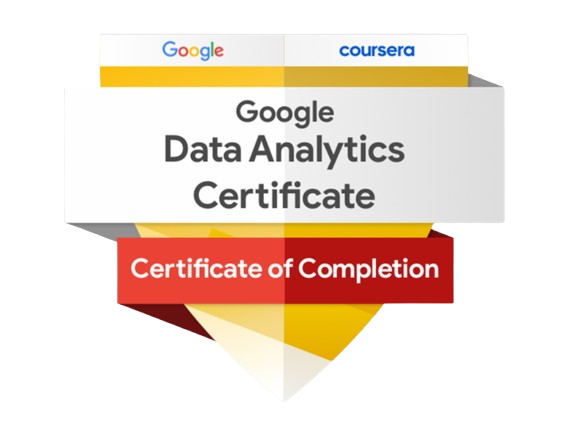

# 👨🏻‍💻 Lucas Moura  
**`Analista de Dados | BI | SQL`**

Profissional de dados focado em BI, SQL e criação de dashboards estratégicos. Trabalho com Power BI, modelagem dimensional e métricas de negócio, sempre com foco em performance, clareza e entrega de valor.

---

## 🔍 Sobre mim  

- 🎓 Análise e Desenvolvimento de Sistemas — conclusão em 2026  
- 📊 Atuação prática com SQL Server, DAX e modelagem para BI  
- 📈 Experiência com indicadores financeiros, comerciais e operacionais  
- 🔧 Construção de modelos analíticos e ETL para dashboards  
- 📘 Formação complementar em Data Analytics (Alura)

---

## 🧩 Hard Skills

## 🧰 Stack Técnica

### **💾 Banco de Dados**
- SQL Server (queries, joins, CTEs, views, modelagem)  
- Criação de tabelas analíticas e estruturas para BI  

### **📊 Business Intelligence**
- Power BI (DAX avançado, medidas, modelagem estrela)  
- Dashboards executivos e indicadores estratégicos  

### **⚙️ Dados**
- ETL / tratamento  
- Power Query  
- Python básico (limpeza e análise)

---

## 🚀 Projeto em Destaque  
### 🟨 **Power BI – Crédito & Risco** *(Projeto principal)*  
Painel analítico com:  
- visão executiva da carteira  
- bucket de atraso  
- inadimplência  
- saldo vencido / a vencer  
- análise da evolução da carteira  

👉 **Acesse:** https://lucasmouradata.github.io/portfolio/

---
## 📜 Certificações

## 📁 Portfólio Completo

- 🌐 **Portfólio (GitHub Pages):**  
  https://lucasmouradata.github.io/portfolio/

- 🟦 **LinkedIn:**  
  https://www.linkedin.com/in/lucas-moura-lm13/

---

## 📬 Contato  

 

